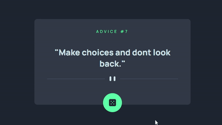
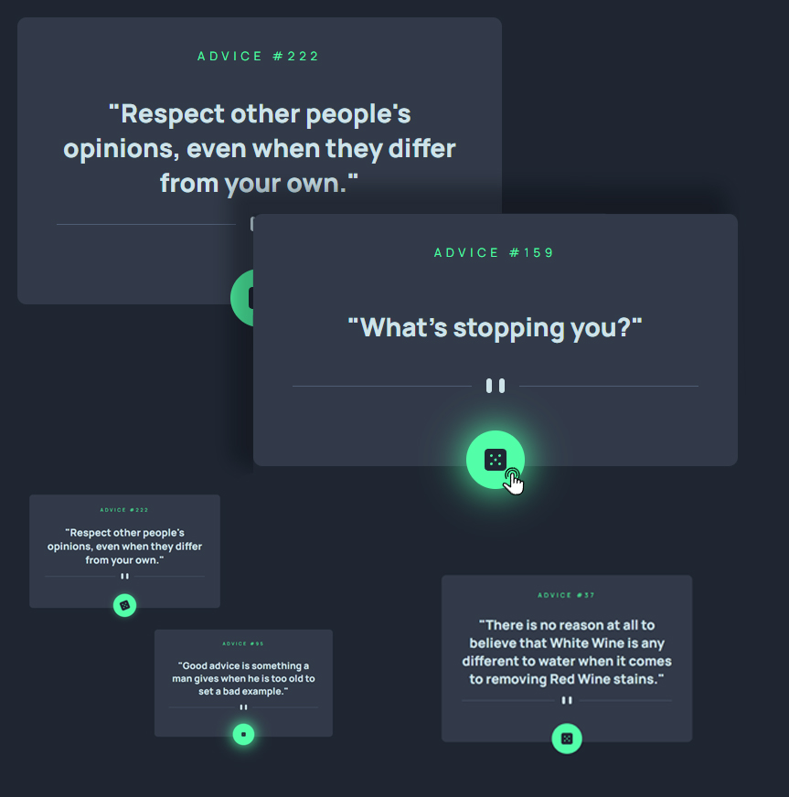

<h1 align="center">Frontend Mentor - Advice generator app solution</h1>

This is a solution to the <a href="https://www.frontendmentor.io/challenges/advice-generator-app-QdUG-13db">Advice generator app challenge on Frontend Mentor</a>. 

<h4 align="center">Frontend Mentor challenges help you improve your coding skills by building realistic projects.</h4>
 

<a href= "https://potatbut.github.io/advice-generator-app/">DEMO 👁️‍🗨️</a>&nbsp;|&nbsp;
<a href= "https://www.last.fm/user/daigo-anon">CHALLENGE 🕹️</a>&nbsp;|&nbsp;
<a href= "https://github.com/potatbut">MY PROFILE 🧚‍♀️</a>

 
<h2 align="center"><a href= "https://potatbut.github.io/advice-generator-app/">🎲 Click the dice button and get the best advice in the world! 🎲</a></h2>
 
<h2 align="center">Built with</h2>

 
<h2 align="center">Animated preview</h2>

 
<h2 align="center">Screenshots</h2>

 
